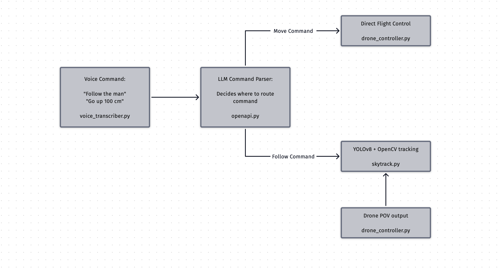

# Agentic LLM Autonomous Drone

This project implements an **LLM-powered, voice-controlled drone system** capable of executing both discrete flight commands and continuous real-time object tracking.  
It combines **OpenAI's GPT function calling**, **Whisper speech-to-text**, **YOLOv8 + OpenCV** vision, and **multi-threaded flight control** to deliver a fully conversational drone experience.

---

## ✨ Features

- **Conversational Voice Control** — Issue natural language commands like:
  - `"take off"`
  - `"turn around 180 degrees"`
  - `"follow the man in the gray shirt"`
- **Agentic LLM Decision-Making** — OpenAI agent decides whether to:
  - Send **discrete commands** (e.g., move up, rotate, land)
  - Activate **continuous follow mode**
- **Computer Vision Tracking** — YOLOv8 + OpenCV for robust, occlusion-resilient target following
- **Multi-threaded Execution** — Heartbeat thread, video streaming, and continuous movement updates
- **Hardware Agnostic** — Built for DJI Tello but adaptable to other drone platforms

---

## 📂 Repository Structure

```
.
├── Drone+OpenAI/
│ ├── voice_transcriber.py # Whisper-based speech-to-text
│ ├── openAPI.py # OpenAI agent, command parsing, and action routing
│ ├── drone_controller.py # Direct flight control logic for discrete commands
│ └── skytrack.py # YOLOv8 + OpenCV continuous tracking mode
│
├── Yolo Model/
│ ├── requirements.txt # Python dependencies
│ └── yolov8n.pt # YOLO model weights
│
└── README.md 
```

---

## 🛠 Setup Instructions

### 1. Clone the Repository
```bash
git clone https://github.com/elijahtab/SkyPilot.git
cd llm-drone
```

### 2. Create a Virtual Environment
**Windows:**
```bash
python -m venv myenv
.\myenv\Scripts\activate
```
**macOS/Linux:**
```bash
python3 -m venv myenv
source myenv/bin/activate
```

### 3. Install Dependencies
```bash
pip install -r requirements.txt
```


---

## 🚀 Running the Drone System

### 1. Connect Your Drone
Ensure your DJI Tello (or compatible drone) is powered on and connected to your machine via WiFi. You would need your main chip connected to the Tello Wifi and a hotspot or secondary wifi card connected to an actual wifi source.

### 2. Start VDrone
```bash
python openapi.py
```
This starts the pipeline with a Whisper-based transcriber and routes recognized commands into the LLM pipeline.

### 3. Issue Commands
Examples:
- `"take off"`
- `"move up 100 cm"`
- `"rotate 90 degrees"`
- `"follow the person in the red shirt"`

### 4. Stop or Land
Say `"land"` to initiate landing.

---

## 📡 How It Works

### Drone + OpenAI Pipeline
1. **Voice Input**  
   `voice_transcriber.py` uses Whisper to transcribe your speech into text.

2. **LLM Command Parsing**  
   `openAPI.py` sends the text to an OpenAI agent, which decides whether the command is:  
   - A **discrete action** (sent to `drone_controller.py`)  
   - A **continuous tracking mode** (sent to `skytrack.py`)

3. **Drone Execution**  
   - **Discrete commands**: altitude changes, rotations, land/takeoff  
   - **Continuous tracking**: YOLOv8 + OpenCV locks onto the target and maintains smooth pursuit

#### Pipeline Diagram


---

### YOLOv8 Inference Workflow
1. **Test Detection on Sample Image**  
   ```bash
   python test_yolo.py


---

## ⚙️ Technical Challenges

- **Multi-threading** — Required for stable flight control, heartbeat signals, and smooth tracking
- **Smooth Follow** — Fine-tuning speed, acceleration, and update intervals to avoid overshooting
- **Vision Model Choice** — Switching between fast OpenCV trackers and robust YOLOv8
- **Voice Isolation** — Minimizing false triggers in noisy environments

---

## 📹 Demo Video
[](https://www.youtube.com/watch?v=iRPw58BgnR8)

---

## 📌 Next Steps
- Integrate GPS and onboard sensors for outdoor and large-area tracking
- Expand follow mode to multiple object classes
- Enhance voice pipeline with custom hotword detection

---

## 🔗 Links
- **GitHub Repo:** [YOUR REPO LINK](https://github.com/Elijahtab/SkyPilot)

---
